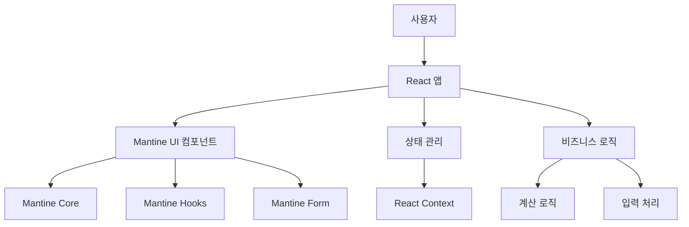
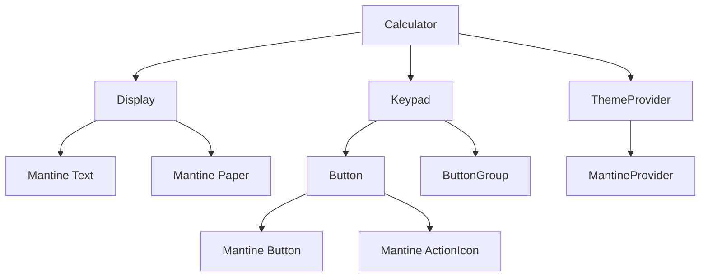
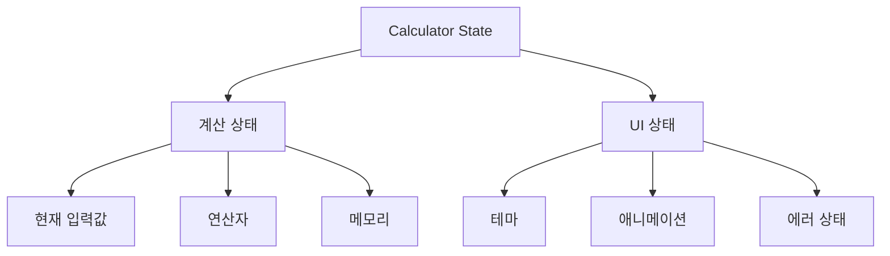
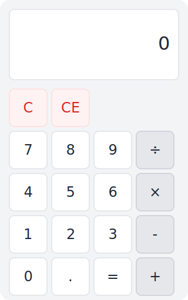

# 바이브 코딩 계산기 설계 문서

## 1. 시스템 아키텍처

## 2. 기술 스택

### 2.1 프론트엔드
- React 18
- TypeScript
- Mantine UI v7
  - Mantine Core: 기본 UI 컴포넌트
  - Mantine Hooks: 커스텀 훅
  - Mantine Form: 폼 관리
  - Mantine Notifications: 알림 시스템
- Vite (빌드 도구)

### 2.2 개발 도구
- ESLint + Prettier
- Jest + React Testing Library
- GitHub Actions

## 3. 컴포넌트 구조

### 3.1 컴포넌트 상세
- `Calculator`: 최상위 컴포넌트
  - Mantine `AppShell` 사용
  - 반응형 레이아웃
  - 테마 관리
- `Display`: 계산기 디스플레이
  - Mantine `Paper` 컴포넌트
  - Mantine `Text` 컴포넌트
  - 애니메이션 효과
- `Keypad`: 키패드 영역
  - Mantine `SimpleGrid` 레이아웃
  - Mantine `Button` 컴포넌트
  - Mantine `ActionIcon` 컴포넌트
- `Button`: 재사용 가능한 버튼
  - Mantine `Button` 확장
  - 테마 기반 스타일링
  - 접근성 지원

## 4. 상태 관리

### 4.1 상태 관리 전략
- React Context API 사용
- Mantine의 `useLocalStorage` 훅 활용
- 상태 업데이트 최적화

## 5. UI/UX 설계

### 5.1 계산기 UI 디자인

#### 5.1.1 UI 구성 요소
- 디스플레이 영역
  - Mantine `Paper` 컴포넌트
  - Mantine `Text` 컴포넌트
  - 반응형 폰트 크기
- 키패드 영역
  - Mantine `SimpleGrid` 레이아웃
  - Mantine `Button` 컴포넌트
  - Mantine `ActionIcon` 컴포넌트
- 레이아웃
  - Mantine `AppShell` 사용
  - 모바일 우선 디자인
  - 그리드 시스템
- 색상 시스템
  - Mantine 테마 시스템 활용
  - 다크 모드 지원
  - 브랜드 컬러 적용
- 타이포그래피
  - Mantine 기본 폰트 스택
  - 반응형 폰트 크기
  - 가독성 최적화

### 5.2 사용자 경험
- 직관적인 인터페이스
- 즉각적인 피드백
- 키보드 접근성
- 모바일 최적화
- 다크 모드 지원

## 6. 성능 최적화

### 6.1 렌더링 최적화
- React.memo 사용
- Mantine 컴포넌트 최적화
- 가상화 적용

### 6.2 번들 최적화
- 코드 스플리팅
- Mantine 컴포넌트 지연 로딩
- 트리 쉐이킹

## 7. 테스트 전략

### 7.1 단위 테스트
- Jest + React Testing Library
- Mantine 컴포넌트 테스트
- 유틸리티 함수 테스트

### 7.2 통합 테스트
- 사용자 시나리오 테스트
- 성능 테스트
- 접근성 테스트

## 8. 접근성

### 8.1 접근성 표준
- WCAG 2.1 준수
- Mantine 접근성 기능 활용
- 키보드 네비게이션
- 스크린 리더 지원

## 9. 배포 전략

### 9.1 빌드 프로세스
- Vite 빌드 설정
- 환경 변수 관리
- Mantine 번들 최적화

### 9.2 배포 파이프라인
- GitHub Actions
- 자동화된 테스트
- 지속적 배포

## 10. 유지보수 계획

### 10.1 코드 품질
- ESLint 규칙
- TypeScript 타입 체크
- Mantine 버전 관리

### 10.2 문서화
- JSDoc 주석
- Storybook 문서
- 사용자 가이드 